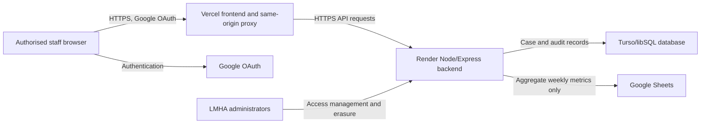

# Data Protection Impact Assessment

## LMHA Case Management System

| Document control | Value |
|---|---|
| Status | Draft — organisational review and approval required |
| Version | 0.2 |
| Prepared | 12 September 2026 |
| Data controller | Limerick Mental Health Association — **legal entity status and full address to be confirmed; postcode supplied: V94 E6HD** |
| Project owner | Limerick Mental Health Association — **named accountable person required** |
| DPIA owner | **TBD** |
| DPO/data-protection adviser | **TBD: name or state why a DPO is not required** |
| Review date | Before live personal data; then annually and after material change |

> This working document supports LMHA's compliance process. It is not legal
> advice and is not complete until the controller has validated all **TBD** items,
> completed the actions, assessed residual risks, and signed the approval record.

## 1. Decision and scope

A DPIA is required or, at minimum, strongly indicated before deployment because
the system introduces a new digital process for identifiable mental-health and
support information concerning people who may be vulnerable. Health information
is special-category data under Article 9 GDPR. The Irish Data Protection
Commission (DPC) states that a DPIA is mandatory for new processing likely to
result in high risk and identifies sensitive data and vulnerable data subjects as
important risk criteria.

This DPIA covers the LMHA/Solace Café web application, its database, authentication,
reporting to Google Sheets, hosting, administration, backups, support, and staff use.
It does not cover unrelated LMHA systems or paper files except where information is
migrated to or copied from this system.

## 2. Processing and purposes

The system supports staff-only case administration, including:

- recording calls, walk-ins, crises, appointments and attendance;
- recording service-user identity, contact and demographic information;
- recording referrals, support needs, limitations and case notes;
- scheduling staff and preventing booking conflicts;
- producing aggregate service metrics and submitting them to Google Sheets;
- managing authorised staff accounts;
- anonymising identifying data following an approved erasure request; and
- recording an audit history of material access and changes.

It must not be used for automated decision-making, profiling, clinical diagnosis,
marketing, fundraising, or a new purpose without a documented compatibility review
and, where necessary, an updated DPIA and privacy notice.

## 3. People and data

### Data subjects

- LMHA and Solace Café service users, including people in crisis or other vulnerable situations;
- emergency contacts, GPs and referrers named by service users;
- staff, administrators and volunteers using the system.

The service has confirmed that people under 18 are not in scope. The application
must not be used to record an under-18 without first expanding this DPIA for
children's data, safeguarding, consent/authority and age-appropriate transparency.

### Data categories

| Category | Examples found in the application | Classification |
|---|---|---|
| Identity/contact | name, phone, email, address | Personal data |
| Demographics | age group, gender, living arrangement, language | Personal data; may reveal sensitive context |
| Health/support | mental-health support needs, crisis attendance, limitations, case notes, ED diversion | Special-category health data or highly sensitive data |
| Third parties | emergency contact, GP and referrer details | Personal data about other people |
| Service activity | date/time, location, interaction, attendance, referrals and outcomes | Personal data while linked to a person |
| Staff/account | staff email, role, assignments, signatures | Personal data |
| Security/audit | actor email, action, record IDs, location, time and request ID | Personal data |
| Aggregate reporting | weekly counts submitted to Google Sheets | Intended to be non-identifying; small-number disclosure must be assessed |

The application must not receive PPS numbers, payment-card information, uploaded
identity documents, passwords, or unrestricted clinical records.

### Scale and frequency

The current estimate is 20–60 service users, with annual new records likely to be
in the hundreds. Approximately 10 staff will use the system. Service delivery is
limited to Limerick. The expected system lifetime and more reliable annual volume
must be confirmed after the first operating year. LMHA must document whether the
processing is considered large scale after taking advice.

## 4. Data flow

The browser receives client information needed for the selected workflow. The
backend validates the signed authentication cookie, CSRF token and selected location.
Google OAuth supplies staff identity. Case records remain in Turso. The intended
Google Sheets transfer contains aggregate totals, not names or case notes. Reports
may be downloaded but are not normally printed; the download location, access and
deletion arrangements remain to be defined.

The reported deployment regions are Ireland for Turso and EU West for Vercel/Render.
These are unverified operational statements and must be confirmed from each provider's
production configuration and contractual documentation.

**TBD before approval:**

- confirm the actual production accounts, legal entities, service regions and subprocessors;
- confirm whether provider support personnel can access data and on what basis;
- document any transfer outside the EEA and its transfer mechanism;
- inspect a real metrics sheet to confirm no identifying data or unsafe small-cell detail is exported;
- document backup locations and flows; and
- confirm whether paper/legacy data will be imported and securely disposed of.

## 5. Lawfulness, necessity and proportionality

LMHA, as controller, must record both:

1. an Article 6 lawful basis for each purpose; and
2. an Article 9(2) condition for any special-category processing.

| Purpose | Article 6 basis | Article 9 condition | Owner/evidence |
|---|---|---|---|
| Deliver and administer support services | **TBD — legal review required** | **TBD — legal review required** | **TBD** |
| Safeguarding/emergency response | **TBD** | **TBD** | **TBD** |
| Aggregate reporting/funder obligations | **TBD** | **TBD if source processing remains identifiable** | **TBD** |
| Security and audit logging | **TBD** | **TBD where log links to health-service use** | **TBD** |
| Staff access administration | **TBD** | Normally not applicable unless sensitive staff data is used | **TBD** |

Do not assume ordinary consent is the correct basis simply because acknowledgements
appear on the intake form. LMHA currently reports relying on consent, but it is
unknown whether a person can receive support after refusing recording. Consent must
be freely given and withdrawable, which may
not fit essential service administration or crisis contexts. Obtain advice appropriate
to LMHA's combined mental-health conversation, peer/social care and crisis-support
services, its HSE funding, and its obligation to report aggregate metrics to the HSE.

Necessity is provisionally supported because centralised scheduling and case continuity
cannot be achieved reliably from aggregate data alone. Proportionality is conditional
on the data-minimisation, retention, access, security and transparency actions below.

## 6. Transparency and individual rights

Before collection, LMHA must provide a clear privacy notice covering controller
identity, purposes, lawful bases, Article 9 conditions, recipients, transfers,
retention, rights, complaint routes and whether provision is mandatory. It should
also explain confidentiality limits and emergency/safeguarding disclosures without
overstating confidentiality.

LMHA must maintain documented procedures for access, correction, restriction,
objection, portability where applicable, and erasure. Identity must be verified
proportionately. Searches must include linked bookings, intake information, audit
records and relevant copies/exports. The current admin erasure function anonymises
selected fields; it is not, by itself, a complete rights-request procedure.

**TBD:** rights-request owner, contact channel, identity-verification method, response
workflow, exemptions review and response log.

## 7. Existing controls confirmed in the codebase

- Google OAuth with an explicit allowlist and admin/worker roles;
- eight-hour signed `HttpOnly` authentication cookie;
- CSRF protection on state-changing requests;
- production environment validation and no secrets committed in reviewed files;
- location validation, historical-edit restrictions and input validation;
- rate limiting, response size limits, restrictive security headers and no-store caching;
- no hard deletion of bookings; cancellation preserves service history;
- admin-controlled anonymisation of identifying client fields;
- append-only application audit events for material record access, changes, exports and access administration;
- audit metadata records field names rather than sensitive before/after values; and
- bounded list/search responses and aggregate-only reporting design.

The intended access model currently gives every worker access to both locations and
all service users. Access removal is intended to occur the same day a worker leaves.
The suggestion that any worker could be made an administrator is not an approved
control: administrator rights include staff-access management, audit-log access and
client anonymisation and must be limited to specifically authorised personnel.

Staff are expected to use charity-owned devices, which may be shared. Encryption and
automatic screen locking have been assumed but not verified. Remote access is not
expected, but this also requires an explicit policy rather than an assumption.

These controls require production configuration and operational testing; code review
alone does not prove the controls operate correctly in the deployed environment.

## 8. Risk assessment and treatment plan

Risk scale: likelihood and severity are Low/Medium/High. Overall risk reflects the
position before the listed additional action. The owner must reassess residual risk
after evidence is attached.

| ID | Risk to individuals | Likelihood | Severity | Initial risk | Required treatment before live use | Target residual risk |
|---|---|---:|---:|---:|---|---:|
| R1 | Unauthorised staff access or excessive access exposes sensitive case data; all workers are currently intended to see all records | Medium | High | High | Document why organisation-wide access is necessary; limit administrator rights to named authorised personnel; quarterly access review; same-day leaver removal; individual accounts and MFA | Medium |
| R2 | Compromised OAuth, hosting or database credential exposes records; production accounts are personally owned by Mark Geary | High | High | High | Transfer GitHub, Vercel, Render, Turso and Google ownership to LMHA-controlled accounts; MFA, password manager, credential rotation, restricted provider roles and alerts | Medium |
| R3 | Indefinite retention causes unnecessary harm or unlawful storage | High | High | High | Approve category-specific retention schedule; implement review/deletion/anonymisation process including backups and Sheets | Medium |
| R4 | Incomplete lawful-basis or Article 9 analysis makes processing unfair/unlawful | Medium | High | High | Controller/DPO/legal approval of the table in section 5 before collection | Low |
| R5 | People are not properly informed or cannot exercise their rights | Medium | High | High | Issue privacy notice and rights procedures; train staff; test a mock access and erasure request | Medium |
| R6 | A breach is missed, investigated late, or not notified in time | Medium | High | High | Breach plan, named response team, provider contacts, breach register, notification decision process and exercises | Medium |
| R7 | Data loss or corruption harms service continuity or record accuracy; no backup process is currently confirmed | High | High | High | Automated backups, documented RPO/RTO, restore permissions and successful scheduled restore test | Medium |
| R8 | Identifying information is disclosed through Google Sheets, downloaded reports or shared devices | Medium | High | High | Verify exports contain totals only; restrict sheet and download access; approve download storage/deletion; verify tablet encryption/auto-lock and use individual logins on shared devices | Medium |
| R9 | Third-party providers or international transfers lack adequate terms/safeguards | Medium | High | High | Supplier due diligence, Article 28 terms, subprocessor/region record, transfer assessment and SCCs/adequacy evidence where needed | Medium |
| R10 | Free-text fields contain excessive or inaccurate clinical/safeguarding detail | High | High | High | Staff guidance, mandatory training, periodic quality review and minimisation prompts; prohibit speculation and irrelevant third-party detail | Medium |
| R11 | Audit logs themselves reveal sensitive service use or are misused | Low | High | Medium | Admin-only access, access reviews, retention period, monitoring and no sensitive values in metadata | Low |
| R12 | An anonymisation request leaves identity in free text, audit, backups or exports | Medium | High | High | Human review checklist across all stores; define backup suppression; verify result; retain only defensible non-identifying evidence | Medium |
| R13 | Vulnerable person suffers distress, stigma, discrimination or safety risk following disclosure | Medium | High | High | Complete all High-risk controls, minimise collection, confidentiality training, rapid containment/support process | Medium |
| R14 | Vendor outage prevents access during a crisis | Medium | High | High | Formalise the proposed paper fallback, secure it, define later reconciliation/destruction, and add provider monitoring and a recovery runbook | Medium |

No initial High risk should be accepted without a named owner, evidence, residual-risk
assessment and controller approval. If residual High risk remains that LMHA cannot
mitigate, obtain advice on prior consultation with the DPC before processing begins.

## 9. Consultation

The following consultation must be recorded:

| Stakeholder | Questions | Date/outcome |
|---|---|---|
| Service managers and frontline staff | Minimum data needed, workflows, emergency access, retention | **TBD** |
| Service-user representatives | Clarity, dignity, control, unexpected uses, rights and concerns | **TBD or documented reason not consulted** |
| DPO/data-protection adviser | Lawful bases, Article 9, rights, retention, suppliers and residual risks | **TBD** |
| Safeguarding lead | Crisis records, disclosures and confidentiality limits | **TBD** |
| IT/security support | Accounts, logs, backups, incident response and recovery | **TBD** |
| Vercel, Render, Turso and Google | Terms, locations, subprocessors, security and deletion/return | **TBD** |

## 10. Mandatory pre-live actions

- [ ] Confirm controller identity, owners and DPO/adviser involvement.
- [ ] Approve Article 6 bases and Article 9 conditions with evidence.
- [x] Confirm whether under-18s are in scope — confirmed no; record change trigger.
- [ ] Approve and publish the privacy notice.
- [ ] Approve the retention schedule and operational deletion/anonymisation procedure.
- [ ] Complete supplier/transfer due diligence and processor agreements.
- [ ] Transfer production accounts to LMHA ownership, enable MFA and rotate secrets.
- [ ] Decide and implement staff/location least privilege.
- [ ] Document breach, rights-request, leaver and business-continuity procedures.
- [ ] Configure backups and pass a restore test.
- [ ] Verify Google Sheets output/sharing and small-number disclosure controls.
- [ ] Complete staff data-protection, confidentiality and secure-device training.
- [ ] Perform production security and user-acceptance tests with synthetic data.
- [ ] Reassess every risk and formally accept residual risks.

## 11. Approval

Processing real service-user data is **not approved by this draft**.

| Role | Name | Decision/signature | Date |
|---|---|---|---|
| Project/business owner | **TBD** | **TBD** | **TBD** |
| Data controller authorised representative | **TBD** | **TBD** | **TBD** |
| DPO/data-protection adviser comments | **TBD** | **TBD** | **TBD** |
| Information security/IT owner | **TBD** | **TBD** | **TBD** |

Next scheduled review: **TBD**, and earlier following a breach, new data category,
new purpose, material provider/hosting change, significant workflow change, use by
children, automated decision-making, or evidence that controls are ineffective.

## Authoritative references

- [DPC: Data Protection Impact Assessments](https://www.dataprotection.ie/en/organisations/know-your-obligations/data-protection-impact-assessments)
- [DPC: Sample DPIA Template](https://www.dataprotection.ie/sites/default/files/uploads/2024-11/Sample-DPIA-Template-EN.pdf)
- [DPC: Special Category Data](https://www.dataprotection.ie/en/organisations/know-your-obligations/lawful-processing/special-category-data)
- [DPC: Self-Assessment Checklist](https://dataprotection.ie/en/organisations/resources-organisations/self-assessment-checklist)
- [DPC: Prior Consultation](https://www.dataprotection.ie/en/organisations/know-your-obligations/data-protection-impact-assessments/prior-consultation)
- [GDPR consolidated text](https://eur-lex.europa.eu/eli/reg/2016/679/oj)
